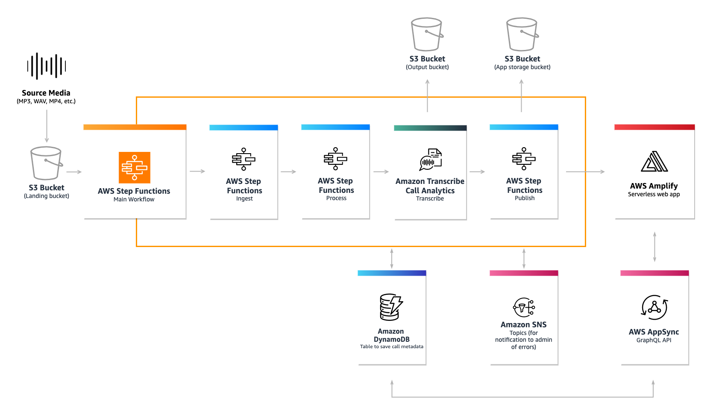
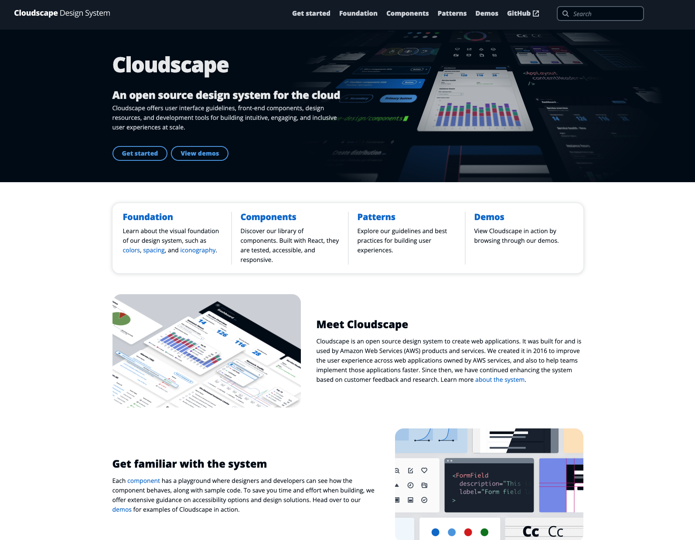
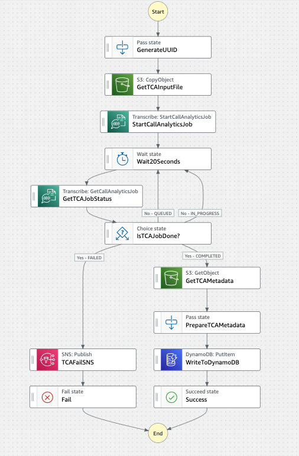

# Welcome to Amazon TCA Quickstart for Terraform 🎉
#### Created by [Kevon Mayers](https://www.linkedin.com/in/kevonmayers)
-01.jpg)

**Amazon Transcribe Call Analytics Quickstart (TCAQS)** is a Contact Center Intelligence (CCI) solution built on existing AWS Services. Amazon Transcribe Call Analytics Quickstart leverages the **Amazon Transcribe Call Analytics API** - an ML-powered API for generating highly accurate call transcripts and extracting conversation insights to improve customer experience and agent productivity. This quickstart includes a purpose-built data pipeline, fine-grained access control, GraphQL API, and sample AWS Amplify full stack web application. TCAQS data is ingested through the **TCAQS landing zone**, and can be ingested from any service within or connected to the AWS cloud.

## 🛠 What you will build



1. Amazon TCA input data is supported in formats including **AMR, FLAC, MP3, MP4, Ogg, WebM, and WAV**. Transcription output is in JSON format. Supported sources include existing file storage locations, you simply need to get files of the supported formats into the TCA Landing S3 bucket.
2. Amazon S3 provides a single landing zone for all ingested files. Data ingress to the **TCA Landing Bucket** triggers the data pipeline.
3. **AWS Step Functions Workflow** orchestrates the data pipeline and requires no AWS Lambda functions, which can *vastly* reduce the complexity of deployment with **Infrastructure as Code**. There are many new [intrinsic functions](https://docs.aws.amazon.com/step-functions/latest/dg/amazon-states-language-intrinsic-functions.html) that enable you to transform your data in a number of ways, many of which previously would have required the use of Lambda functions. There is also [support for the AWS SDK](https://docs.aws.amazon.com/step-functions/latest/dg/supported-services-awssdk.html) which enables you to natively call AWS service API actions without the use of Lambda functions. See [this blog post](https://aws.amazon.com/blogs/compute/introducing-new-intrinsic-functions-for-aws-step-functions/) for more information on the new additions to intrinsic functions and [this blog post](https://docs.aws.amazon.com/step-functions/latest/dg/supported-services-awssdk.html) for information on the AWS SDK support.
4. **Amazon S3** provides data highly available and scalable object storage and **AWS DynamoDB** serves as the storage location for call metadata and is the data source for the **AWS AppSync GraphQL API**.
5. **AWS AppSync** provides a GraphQL API backend for integration with web applications and other data consumer applications, and **AWS Amplify** provides a serverless pre-configured management application that includes basic data browsing, data visualization, data uploader, and application configuration.

The Amplify App is leveraging [Cloudscape](https://cloudscape.design/) an open-source React component library released by AWS. If it looks familiar to you, it is because the AWS Console is built with it.

## AWS Service List
There are a number of AWS services used in this solution including:
- **[Amazon S3](https://aws.amazon.com/s3/)** - Data storage
- **[Amazon DynamoDB](https://aws.amazon.com/dynamodb/)** - Call transcription storage
- **[AWS AppSync](https://aws.amazon.com/appsync/)** - GraphQL API
- **[AWS Amplify](https://aws.amazon.com/amplify/)** - Full stack serverless web application
- **[AWS CodeCommit](https://aws.amazon.com/codecommit/)** - Git repository
- **[Amazon Cognito](https://aws.amazon.com/cognito/)** - Web app/API authentication/authorization
- **[Amazon EventBridge](https://aws.amazon.com/eventbridge/)** - Aggregation of notifications to trigger the Step Function
- **[Amazon IAM](https://aws.amazon.com/iam/)** - Security access control
- **[AWS Step Functions](https://aws.amazon.com/step-functions/)** - Low-code orchestration of data pipeline
- **[AWS Systems Manager Parameter Store](https://docs.aws.amazon.com/systems-manager/latest/userguide/systems-manager-parameter-store.html)** - secure, hierarchical storage for configuration data and secrets management

### Terraform

This solution is deployed leveraging [Terraform](https://terraform.io), an open-source infrastructure as code software tool created by [HashiCorp](https://www.hashicorp.com/). Our custom Terraform module **`tca-qs`** abstracts away the vast majority of the coding. Variables are available for use to dynamically customize your deployment.

Please review the [Terraform Examples Documentation](terraform-deployment/examples/README.md) for examples to use for deployment. The `main.tf` file at `/terraform-deployment/main.tf` also comes preloaded with a sample deployment.

#### 🚀 Resources to be Deployed
**AWS Amplify**
- Web Application (Optional)
  - `TCA-App`

**AWS AppSync**
- GraphQL API
  - `tca-graphql-api`

**AWS CodeCommit**
- Repository (Optional)
  - `tca_codecommit_repo`

**Amazon Cognito**
- `tca_user_pool`
- `tca_identity_pool`
- `tca_user_pool_client`
- `tca_admin_cognito_user_group`
- `tca_admin_cognito_users` (dynamic)
- `tca_standard_cognito_user_group`
- `tca_admin_cognito_users` (dynamic)

**Amazon DynamoDB**
- Table
  - `tca_output`

**Amazon EventBridge**
- Event Bus
  - `tca_event_bus`
- Event Rule
  - `default_event_bus_to_tca_event_bus`
  - `tca_landing_bucket_object_created`

**AWS IAM**
- Roles
  - `tca_amplify_codecommit`
  - `tca_appsync_dynamodb_restricted_access`
  - `tca_cognito_admin_group_restricted_access`
  - `tca_cognito_authrole_restricted_access`
  - `tca_cognito_standard_group_restricted_access`
  - `tca_cognito_unauthrole_restricted_access`
  - `tca_eventbridge_invoke_custom_tca_event_bus_restricted_access`
  - `tca_eventbridge_invoke_sfn_state_machine_restricted_access`
  - `tca_step_functions_master_restricted_access`
- Policies
  - `tca_s3_restricted_access_policy`
  - `tca_dynamodb_restricted_access_policy`
  - `tca_dynamodb_restricted_access_read_only_policy`
  - `tca_ssm_restricted_access_policy`
  - `tca_eventbridge_invoke_custom_tca_event_bus_restricted_access_policy`
  - `tca_eventbridge_invoke_sfn_state_machine_restricted_access_policy`
  - `tca_gitlab_mirroring_policy` (conditional)
- Users
  - `tca_gitlab_mirroring` (conditional)

**Amazon S3**
- Buckets
  - `tca_input_bucket`
  - `tca_output_bucket`
  - `tca_app_storage_bucket`
  - `tca_quicksight_bucket`
  - `tca_s3_logging_bucket`

**AWS SNS**
- Topic
  - `tca_sfn_status`
- Subscription
  - `tca_sfn_status_sqs_target`

**AWS Systems Manager Parameter Store**
- SSM Parameter
  - `ssm_github_access_token` (conditional)
  - `tca_input_bucket_name`
  - `tca_output_bucket_name`
  - `tca_app_storage_bucket_name`
  - `tca_dynamodb_output_table_name`

**Step Functions**
- State Machine
  - `tca-state-machine`

### Data Pipeline

The **TCAQS** data pipeline is an event-driven **AWS Step Functions Workflow** triggered by each upload to the **TCA Landing S3 bucket**. Leveraging **Amazon EventBridge**, when a file matching the supported file type is uploaded to the Landing Bucket, the Step Functions Workflow will be triggered. The data pipeline performs the following functions:

1. **Data Ingestion**: The data will be ingested into the S3 Landing bucket. The landing bucket has a bucket policy that restricts file upload to the [files types supported by Amazon Transcribe](https://docs.aws.amazon.com/transcribe/latest/dg/how-input.html). This reduces the messages going to EventBridge as the EventBridge rule is set to only be used on **`S3:PutObject`** operations. If the file attempted to being uploaded is not a supported file type, the upload will fail and the notification will not be sent to EventBridge. This also means the Step Functions State Machine will not be invoked unless a supported file type is uploaded, reducing potential errors and the number of concurrent Step Functions State Machines running.

2. **Data Preparation**: If the file uploaded matches one of the file types supported by **Amazon Transcribe**, the S3 PutObject notifications will be sent to **EventBridge** and the **Step Function State Machine** will be invoked. The first step will fetch the file from the **S3 Landing bucket**, add a **UUID (Universally Unique Identifier)** to the object key (S3 file name), and copy the file to the TCA Input bucket. The UUID is required because all Amazon Transcribe Jobs must have a unique name. The UUID being used is the **`id`** in the S3 PutObject log. This can also be used for **data lineage** because the same **`id`** present in the log for the original file upload will be in the file name as the file goes through the data pipeline.
3. **Data Processing**: Once the file is copied to the TCA Input bucket with the generated UUID, an **Amazon Transcribe Call Analytics** job will be started for the file. A polling loop is present in the step function to wait 20 seconds, and get the TCA job status. If the status returned is **COMPLETE** the data flows to the next step. If the status is **QUEUED** or **IN PROGRESS** the polling loop will wait 20 seconds again, then check the status. If the job status is **FAILED** and you *enabled SNS notifications*, an SNS notification will be sent to your provided email address.
4. **Data Publishing**: If the **Amazon Transcribe Call Analytics** job was successfully completed, the transcript data (`JSON`) will be written to the TCA Output bucket and the TCA Output DynamoDB Table. The audio file will also be copied to the App Storage bucket for consumption within your Amplify Web Application.

Review the [Step Function Workflow](resources/step-function/tca-step-functions-workflow.jpg) for a visual aid.



**NOTE:** *To optimize costs, there is an [S3 Lifecycle Rule](https://docs.aws.amazon.com/AmazonS3/latest/userguide/object-lifecycle-mgmt.html) present on the **Landing Bucket**, **Input Bucket**, and **Output Bucket**. By default, the rule will expire all objects in the buckets after 24 hours. The necessary data will still be retained however - the media file in the **App Storage Bucket** and the `JSON` data in the DynamoDB table. To modify this, you may disable or modify the lifecycle rules. They are accessible via [Terraform variables](https://www.terraform.io/language/values/variables). Additional costs may apply for removing these rules. For instructions, reference the [tca-qs module documentation](/terraform-deployment//modules/tca-qs/README.md).* If you want to leverage Quicksight, you can modify the Step Function to also copy the `JSON` data from the **Output Bucket** to the optional **Quicksight Bucket**. However, the sample web application has native dashboarding support by leveraging [Cloudscape Design Components](https://cloudscape.design/), so this is not enabled by default. See a demo of an example of an example dashboard [here](https://cloudscape.design/examples/react/dashboard.html?).

### AWS AppSync GraphQL API

A pre-built AWS **AppSync GraphQL API** provides flexible querying for application integration. This GraphQL API is authorized using **Amazon Cognito User Pools** and comes with predefined **Admin** and **Standard** roles. These roles are attached to the respective **Cognito User Pool Groups**. Users added to these groups will be able to assume the attached IAM role. This GraphQL API is used for integration with the **Amazon TCAQS AWS Amplify Sample Web Application**.


### Optional: AWS Amplify Sample Web Application

An AWS Amplify application can be deployed optionally and hosted via Amazon Cloudfront and AWS Amplify. This is **enabled by default** as it is the intended use of the quickstart, but you can disable this and connect the backend resources to your own web application if you wish. For more information on the sample Amplify Application, see the [Sample Amplify App Documentation](/tca-sample-amplify-app/documentation/README.md)


### Sample Data Collection for Testing

The **Amazon TCA Quickstart (TCAQS)** application comes with sample data for testing successful deployment of the application and can be found in the **`resources/sample-media`** directory.

## What it does

This Quickstart provides core functionality to accelerate data ingestion, processing, storage, analytics and insights for your supplied media. The following list outlines the current capabilities and limitations of the Amazon TCA Quickstart. Please submit a PR to request additional capabilities and features. We appreciate your feedback as we continue to improve this offering.

### Capabilities

The following list of capabilities covers current capabilities as recorded and updated September 2022:

1. Accepts all supported Amazon Transcribe source file formats for S3 upload to the **TCA Landing Bucket**
2. Accepts multi-part and standard upload via S3 CLI, Console, and other programmatic means
3. Accepts single file upload via AWS Amplify console with optional web application
4. Supports dynamic creation of the **AWS Step Functions Workflow**
5. Support for [content redaction](https://docs.aws.amazon.com/transcribe/latest/dg/pii-redaction.html) for **Personally Identifiable Information (PII)** in your source media

### Feature Roadmap
1. Support for dynamic creation of **Custom Language Models** within the Amplify Web Application (Coming Soon ⌛)
1. Support for dynamic creation of **Custom Vocabulary** within the Amplify Web Application (Coming Soon ⌛)

### Limitations

The following list of limitations covers current known functional limitations as recorded and updated September 2022:

1. Does not support real-time transcriptions
2. Source media file names cannot contain spaces Ex:`My Audio File`
3. Does not accept multi-file upload via sample web application. Currently this must be done via S3 CLI, SDK, Console, or other programmatic means.


## 💲 Cost and Licenses

You are responsible for the cost of the AWS services used while running this Quick Start reference deployment. There is no additional cost for using this Quick Start.


The custom Terraform module used for this Quick Start was includes configuration parameters that you can customize. Some of these settings can affect the cost of deployment. For cost estimates, see the pricing pages for each AWS service you use. Prices are subject to change.

**Tip:** After you deploy the Quick Start, create [AWS Cost and Usage Reports](https://docs.aws.amazon.com/cur/latest/userguide/what-is-cur.html) to track costs associated with the Quick Start. These reports deliver billing metrics to an S3 bucket in your account. They provide cost estimates based on usage throughout each month and aggregate the data at the end of the month. You can also use [AWS Budgets](https://aws.amazon.com/aws-cost-management/aws-budgets/) to set custom budgets to track your costs and usage, and respond quickly to alerts received from email or SNS notifications if you exceed your threshold. For more information, see [What are AWS Cost and Usage Reports?](https://docs.aws.amazon.com/cur/latest/userguide/what-is-cur.html) and the [AWS Budgets](https://aws.amazon.com/aws-cost-management/aws-budgets/) page.

This Quickstart doesn’t require any software license or AWS Marketplace subscription.

## How to Deploy

The intended deployment method for Amazon TCA Quickstart is by using [Terraform](terraform.io). [AWS Cloud Development Kit (CDK)](https://aws.amazon.com/cdk/) and [AWS CloudFormation](https://www.terraform.io/) support may be added at a later date if there is substantial demand. Until then, if you require deployment with CDK, you can take a look at [CDK for Terraform](https://www.terraform.io/cdktf). We recommend use of VS Code and the AWS CLI. We also generally recommend a fresh AWS account that can be integrated with your existing infrastructure using AWS Organizations.

## 🎒 Pre-requisites

- The [aws-cli](https://docs.aws.amazon.com/cli/latest/userguide/cli-chap-install.html) must be installed *and* configured with an AWS account on the deployment machine (see <https://docs.aws.amazon.com/cli/latest/userguide/cli-chap-install.html> for instructions on how to do this on your preferred development platform). To make sure you have it available on your machine, try running the following command.
  ```sh
  aws --version
  ```
- This project requires [Node.js](http://nodejs.org/). See [How to Install Node.Js](https://nodejs.dev/en/learn/how-to-install-nodejs/) for installation instructions.
To make sure you have it available on your machine, try running the following command.
  ```sh
  node -v
  ```
- This project requires [NPM](http://nodejs.org/). See [Downloading and installing Node.Js and npm](https://docs.npmjs.com/downloading-and-installing-node-js-and-npm) for installation instructions.
To make sure you have it available on your machine, try running the following command.
  ```sh
  npm -v
  ```
- This project requires [Terraform](https://www.terraform.io/). See [Install Terraform](https://learn.hashicorp.com/tutorials/terraform/install-cli) for installation instructions. To make sure you have it available on your machine, try running the following command.

  ```sh
  terraform -v
  ```

For best experience we recommend installing using an [IAM Roles](https://aws.amazon.com/iam/features/manage-roles/) with adequate permissions to deploy the AWS services. It is also recommended to deploy this quickstart into a development/test AWS account.

## 🚀 Setup

### 0/ Use git to clone this repository to your local environment

```sh
git clone #insert-http-or-ssh-for-this-repository
```

### 1/ Set up your AWS environment

- Configure your AWS credentials by running the command **`aws configure`**
- For more on setting up your AWS Credentials please see [Using an IAM role in the AWS CLI](https://docs.aws.amazon.com/cli/latest/userguide/cli-configure-role.html) (Recommended) OR [Named profiles for the AWS CLI](https://docs.aws.amazon.com/cli/latest/userguide/cli-configure-profiles.html)

### 2/ Prepare your Terraform environment

1. Navigate to **`terraform-deployment/main.tf`**
2. The `main.tf` file comes preloaded with a template for deployment. Simply modify the relevant values. You can also use one of the example templates in **`terraform-deployment/examples`** to set up your `main.tf` file. Please read the custom `tca-qs` [module documentation](/terraform-deployment/modules/tca-qs/README.md) and the general [Terraform Documentation](/terraform-deployment/README.md) for more information.

**Example `main.tf`**:
```hcl
module "tca-qs" {
  // location of the module - can be local or git repo
  source = "./modules/tca-qs"

  # SNS
  tca_sns_email_endpoint = "yusuke@spiritgun.com"

  # - Cognito -
  # Admin Users to create
  tca_admin_cognito_users = {
    NarutoUzumaki : {
      username       = "nuzumaki"
      given_name     = "Naruto"
      family_name    = "Uzumaki"
      email          = "naruto@rasengan.com"
      email_verified = true
    },
    SasukeUchiha : {
      username       = "suchiha"
      given_name     = "Sasuke"
      family_name    = "Uchiha"
      email          = "sasuke@chidori.com"
      email_verified = true
    }
  }
  # Standard Users to create
  tca_standard_cognito_users = {
    DefaultStandardUser : {
      username       = "default"
      given_name     = "Default"
      family_name    = "User"
      email          = "example@example.com"
      email_verified = false
    }
  }

}
```

#### **TCA-QS Module Variables**

A full list of the module variables is in the [module documentation](./terraform-deployment/modules/tca-qs/README.md). All variables have default values set based on the function of the Quickstart. These can be modified to customize your deployment. See [this document](./terraform-deployment/README.md) for more information.


**Amplify Web Application Note:** If you choose to deploy the Amplify Web Application make sure you review [web application documentation](/tca-sample-amplify-app/documentation/README.md).

### 3/ Initialize Terraform and plan your infrastructure changes.
Before running these commands, ensure you are in the **`terraform-deployment`** directory.

- Make sure that you have assumed an AWS Profile or credentials through `aws configure` or some other means. [AWSP  - AWS Profile Switcher](https://github.com/johnnyopao/awsp) is an open source GitHub solution that you can look into if you wish.
- Get your AWS Account Number to verify you are in the correct AWS account. Run the command **`aws sts get-caller-identity`**


- Initialize Terraform.

```sh
terraform init
```

- Preview the changes that Terraform plans to make to your infrastructure.

```sh
terraform plan
```


### 4/ Deploy the application

-  **NOTE**: All resources deployed using the custom Terraform Module **`tca-qs`** will have the tags **`IAC_PROVIDER = Terraform`** and **`AppName = TCA-App`**. You can add additional tags in the module's relevant service `.tf` resource files if you wish ( `s3.tf`, `dynamodb.tf`, `iam.tf`, etc.). The Terraform `merge()` function will merge your additional tags with the default tags specified in the module's **`variables.tf`** file. Deployed resources will also start with the prefix **`tca`** for ease of visibility.

**Example:**
```go
  tags = merge(
    {
      "AppName" = var.app_name,
      "Naruto" = "Hokage",
      "Smitty Werbenjägermanjensen" = "#1"
    },
    var.tags,
  )
```

- 👨🏾‍💻 ✅ Apply (execute) the Terraform plan with the command **`terraform apply`**. Note, you will be prompted to accept the changes (Y/N) before the apply will take place.

- 😏 ⛔️ Advanced User: You can bypass these prompts by running the command **`terraform apply --auto-approve`** but this is only recommended if you have experience with Terraform. For those newer to Terraform, it is recommended to follow the prompts.

### 5/ Optional: Set up the Amplify Web Application

If you have chosen to deploy the optional Web Application by leaving the default value of **`create_tca_amplify_app = true`**, there are a few simple steps to get up and running with the web application.

For quick setup follow the instructions below.

#### Quick Setup

If you are reading this it is because you deployed the Amazon TCA Quickstart Web Application by leaving the default value of `create_tca_amplify_app = true` in the `modules/tca-qs/variables.tf` file. Your application is already available via your `localhost`. The web application is leveraging [React](https://reactjs.org/), a javascript framework, and [ViteJS](https://vitejs.dev/) an alternative to CRA (`create-react-app`) that is quite popular and has a some substantial benefits.

1. To deploy the full Amplify Application with Amplify Hosting in AWS, you must connect your repository to the Amplify App. The Quickstart supports 3 ways to do this:
- **Mirror your GitLab repo to AWS CodeCommit**. Push events will trigger the Amplify App to build in AWS. You can specify which branches you wish to trigger the build, by default it will be the main branch. See [setting up GitLab to CodeCommit Mirroring](https://docs.gitlab.com/ee/user/project/repository/mirror/push.html) and the [Amplify App documentation](/tca-sample-amplify-app/documentation/README.md) for more information.
- **Use your GitHub Personal Access Token**. You can alternatively use a GitHub personal access token to give Amplify access to your GitHub repository. See the [Amplify App Documentation](/tca-sample-amplify-app//documentation/README.md) and [Setting up the Amplify GitHub App for AWS CloudFormation, CLI, and SDK deployments](https://docs.aws.amazon.com/amplify/latest/userguide/setting-up-GitHub-access.html) for more information
- **Use an existing AWS CodeCommit Repo**. You can also use an existing AWS CodeCommit repository and directly push to that to trigger the build. Just ensure that the Amplify App has access to your CodeCommit repo via the generated IAM Role. See the [Amplify App Documentation](/tca-sample-amplify-app//documentation/README.md) for more information.

2. Push your code to the repo. This will trigger Amplify to start the build of your Amplify App following the buildspec defined at `/amplify.yml`

3. Visit the AWS Console and search for **AWS Amplify**
4. You should see one application running called **`TCA-App`**. Wait for the build to complete, then click on the URL generated for you.
**(insert image)**

✅ Success! At this point, you should successfully have the Amplify app working.

For detailed instructions, see the [Amplify App Documentation](/tca-sample-amplify-app//documentation//README.md).


## 🗑 How to Destroy
#### Deleting all resources

You can destroy **all** resources deployed by Terraform by running the command **`terraform destroy`**. Similar to the `apply` command, you can ignore the prompts by adding the `--auto-approve` flag to the command.
Ex:
```sh
terraform destroy --auto-approve
```
#### Deleting specific resources
 You can destroy individual resources two ways:
1. **`terraform apply` to Destroy** - Comment out (or delete) the resource in your configuration files and run the command **`terraform apply`**. This will check state file and compare it to the remaining defined resources in your configuration files and make the changes to make the two match (delete the resources that are commented out).
2. **`terraform destroy` to Destroy** - You can add the flag `--target` to your `terraform destroy` command to specify a specific target. You then would need to remove the code from your configuration file or the resources would be re-created the next time you apply your configuration.
Ex:
```sh
terraform destroy --target aws_s3_bucket.tca_quicksight_bucket
```

## Work with outputs

The Terraform module has a number of outputs that you can reference to integrate the deployment into your existing infrastructure, or expand what is deployed by the module. These outputs are defined in the `outputs.tf` file in **`/terraform-deployment/modules/tca-qs/outputs.tf`**. These outputs are being used to dynamically configure the Amplify Application without using the Amplify CLI. To learn more about how this is being done, visit the [Amplify App Documentation](/tca-sample-amplify-app//documentation/README.md). Take a look at [this document](https://www.terraform.io/language/values/outputs) to learn more about [Terraform outputs](https://www.terraform.io/language/values/outputs). For a list of all outputs, visit the [tca-qs module documentation](/terraform-deployment//modules/tca-qs/README.md).


## Extending Amazon TCA Quickstart

If you are looking to utilize existing features of TCAQS while integrating your own features, modules, or applications, please feel free to submit issues that describe use-cases you would like to be documented.


## 👀 See also

- [AWS Energy & Utilities](https://aws.amazon.com/energy/)
- [PCA - Post Call Analytics](https://aws.amazon.com/blogs/machine-learning/post-call-analytics-for-your-contact-center-with-amazon-language-ai-services/)
- [Amazon Transcribe Call Analytics Service Page](https://aws.amazon.com/transcribe/call-analytics/)


